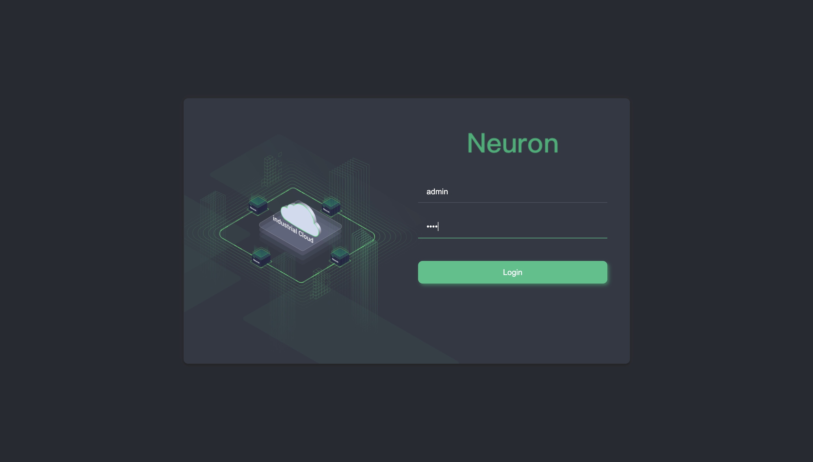
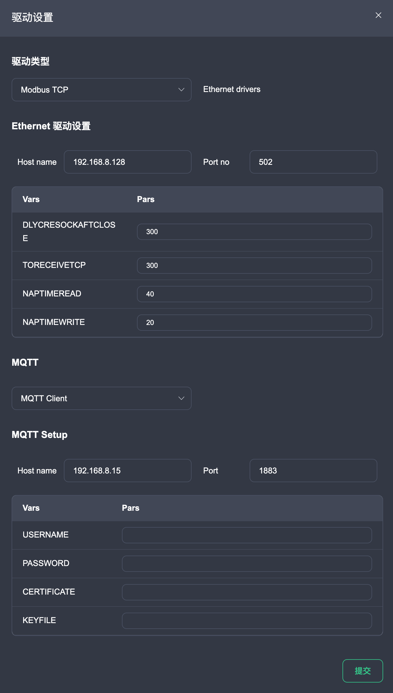
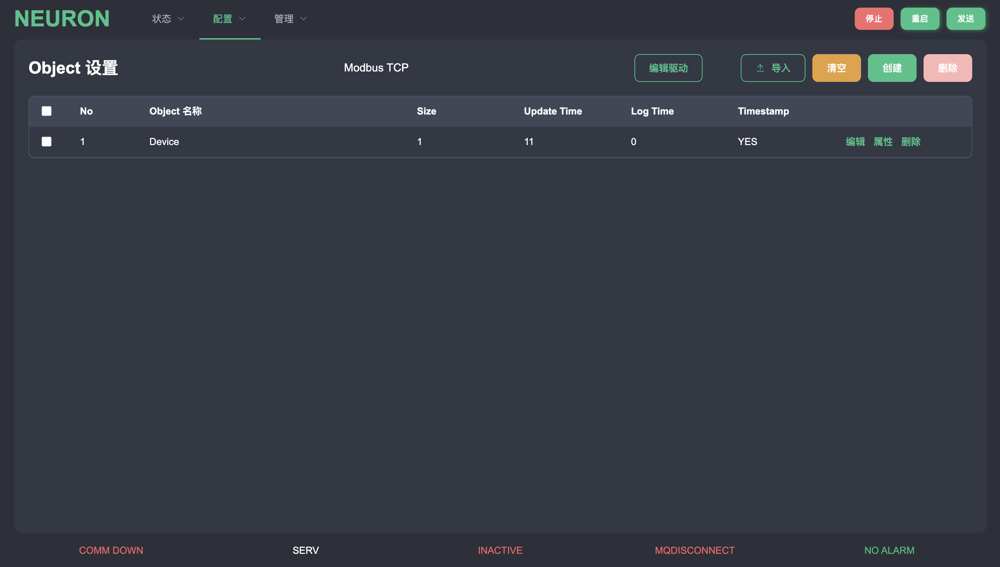
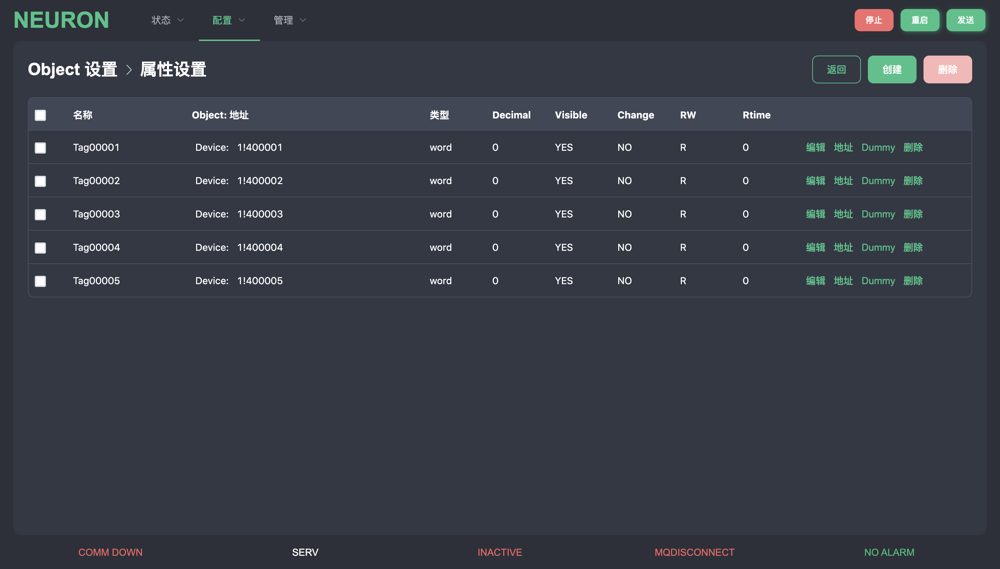
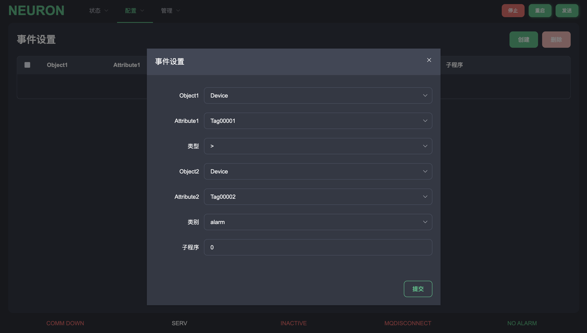
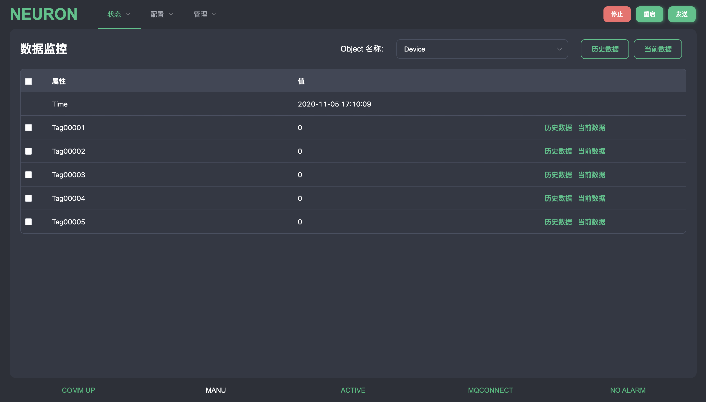
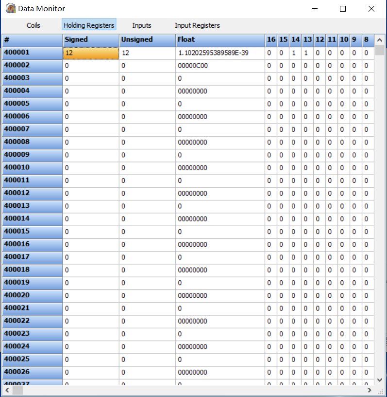
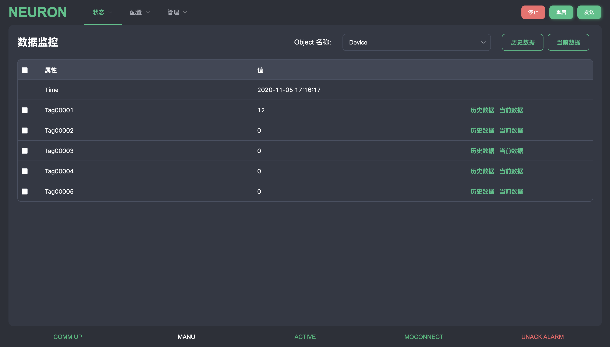
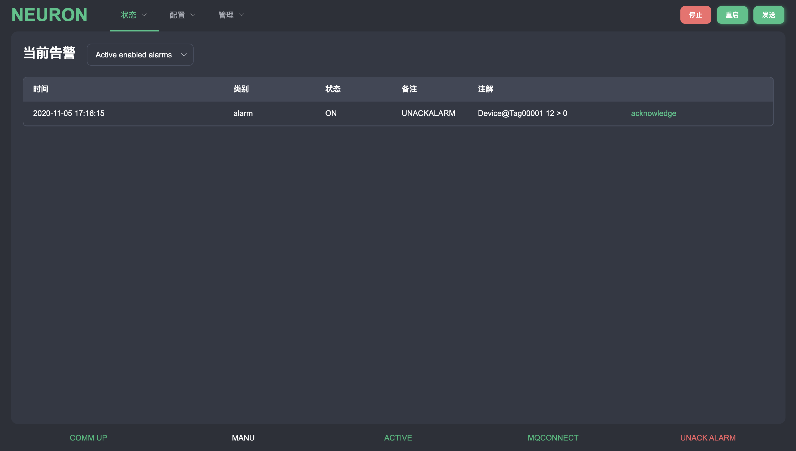
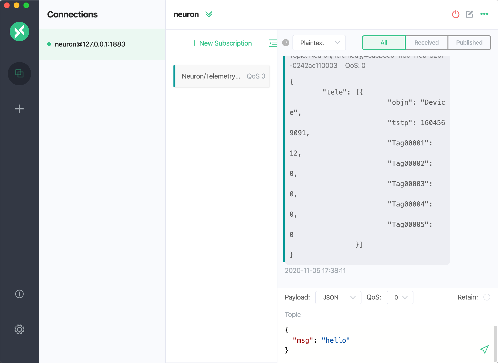

# Quick Guide {#endpoint-quick_started}

The following describes how to quickly use the Neuron instance in a Docker container

## Environment setup {#endpoint-intall}

### Running Neuron in Docker

To get the Docker image

```bash
~\$ docker pull emqx/neuron:1.0.1
```

To start the Docker container

```bash
~\$ docker run -d --name neuron -p 7000:7000 emqx/neuron:1.0.1
```

### Running EMQ X Edge in Docker

In addition to running the Neuron instance, we also need to deploy an MQTT Broker to do message connection processing, it is recommended to use [EMQ X Edge](https://www.emqx.io/cn/downloads#edge), Lightweight edge computing messaging middleware. EMQ X Edge can be quickly installed using Docker containers.

To get the Docker image

```bash
~\$ docker pull emqx/emqx-edge:4.2.2
```

To start the Docker container

```bash
~\$ docker run -d --name emqx -p 1883:1883 -p 18083:18083 emqx/emqx-edge:4.2.2
```

## Resource preparation {#endpoint-resources}

1. Install Modbus simulator: PeakHMISlaveSimulator install and open Modbus TCP slave。

2. Prepare a configured object data table, you can click [neuron_batch_modbus_5.xlsx](https://github.com/emqx/edge-stack/blob/master/developer-scripts/neuron_batch_modbus_5.xlsx) Choose to download to local.

## Run and use {#endpoint-running}

When the environment and resources are ready, we can open a web browser, enter the gateway address and port number you are running, and then enter the management console page. The port number of the Neuron management console is 7000, for example: [http://127.0.0.1:7000](http://127.0.0.1:7000)

### Login

After opening the page, you will enter a login page. At this time, you can use the initial user name and password to log in, user name: admin, password: 0000, after entering, you can modify the initial password for security.



### Driver configuration

After the login is successful, there is no preset data in the system at this time, and it may return `Function not allowed in current mode` error prompt. This error prompt is normal, because the system is currently in `INACTIVE` status.

We select the configuration column in the top menu bar, click Object settings, and enter the object configuration page. We first need to configure the driver. Click the `New Driver` button, and there will be a configuration pop-up box. At the top we select the `Modbus TCP` type. After the selection, the driver settings are required. The required fields are `Host name` and `Port no` In this example, it is the IP address of the machine where the Modbus simulator is prepared. The port is generally 502. The table below is the drive parameters. If necessary, you can modify the default values of the parameters.

After configuring the driver, you need to configure the connectable MQTT Broker information, select `MQTT Client` in the selection box below, and configure the Host address and port number of the EMQ X Edge just installed using Docker. The port number is 1883 by default. The table below shows the optional parameters for connecting to MQTT. You can configure the user name, password, certificate, etc. After the configuration is completed, click the `Submit` button to complete the configuration of a Modbus driver.



### Object configuration

After configuring the driver, we can configure the data of the Object. First, we need to add the Object data, and add the attributes of the Object after completion, and configure the corresponding address for each attribute. In this article, we can use the data for quick use. We can use the download just now. Go to the local object data table and perform data import operations to quickly configure objects. At this point, click the `Import` button above, and select the Excel file that you downloaded locally, and you can successfully import the pre-configured data.





### Event configuration

After configuring the Object, you can choose to configure the event. We select the configuration column in the top menu bar, click Event Settings, enter the event configuration page, select the `Create` button, there will be a pop-up box for event settings, we need to select the attribute data of Object for comparison, because at this time we If there is only one object, we only select the object, and then select two different attributes for comparison. When `Tag00001` is greater than `Tag00002`, an alarm message is triggered, and the type is selected as alarm. You can also fill in the number of the subroutine. When the event is triggered, the subroutine can be executed. There is no subroutine configured here, just fill in a default value. Click the submit button after completion to create the event.



### Sending configuration

After configuring the driver, Object and event, we can send all the configured data to Neuron, just click the `Send` button in the upper right corner and confirm. After the transmission is successful, it will prompt that the system is restarting, return to the login page, wait a few seconds, log in again, and then enter, the page now has all the data that has been configured just now. When the bottom system status is `COMM UP`, `MANU`, `ACTIVE`, `MQCONNECT`, `NO ALARM`, it means that Neuron data configuration is successful and running normally.



### Data point monitoring

At this time, we use the Modbus TCP simulator that was prepared to install in advance, find the address item corresponding to the Object corresponding property, and modify the value again. After setting the value to 12, you can see the table on the data monitoring page under the status menu bar The value of the corresponding attribute changes in real time, and becomes the modified value just now. You can also click the current data to view the data change chart of the current attribute in real time.





### Event point monitoring

We have modified the value of `Tag00001`. At this time, the value is greater than the value of `Tag00002`. You can see a red `UNACK ALARM` status reminder at the bottom, indicating that there is an unconfirmed alarm message. We can select the status menu Column, click the current alarm item to enter the alarm page to view the alarm information, indicating that the event just configured has taken effect. If the alarm has been found, you can click the `acknowledge` button to confirm the alarm. The `UNACK ALARM` at the bottom has changed to `ALARM`, indicating that there is an alarm, but it has been confirmed.



### Report data viewing

At this point, if we can see the status of `MQCONNECT` at the bottom, it means that Neuron has successfully connected to MQTT Broker. We can use the MQTT client to connect to the just deployed EMQ X Edge. MQTT X is recommended here. After opening MQTT X and setting the connection successfully, subscribe to the topic published by Neuron above, the topic format is `Neuron/Telemetry/{neuron-uuid}`, `neuron-uuid` can be accessed through the management console in `Management` -> `About` After the subscription is successful, you can see that MQTT X can always receive the data collected and reported by Neuron.


