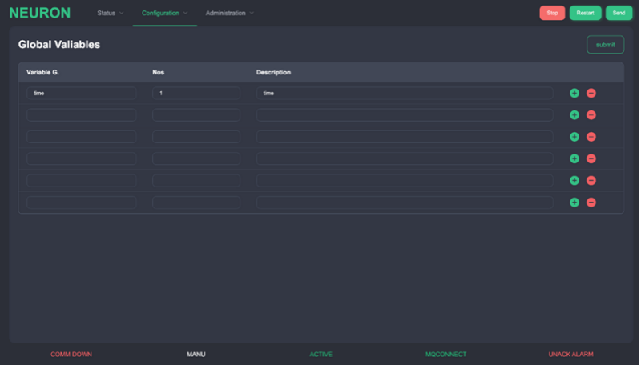

# Neuron Scripts {#endpoint-neuron-scripts}

The Neuron Scripts contains two setup environments which are global variables and script programming. Global variables have some pre-defined internal variables that can be used in scripts programming.

The following is standard global variables that may be used in scripts:

The following is script programming environment:

Script programming environment are divided into two part as above. The left part is statement column and right part is expression column.

## Script Routines {#endpoint-script-routines}

The Neuron agent contains a runtime environment of metaprogramming component which allow users to create some scripts to run in a continues loop for manipulating data and variables. It starts from &quot;Main Routine&quot; and run the corresponding routine either in &quot;Auto Routine&quot; or &quot;Menu Routine&quot; according to the machine mode. The below flowchart shows how these routines relation in the runtime environment.

The various parts of the programming environment are running in a sequential order. First there is an idle loop (time interrupt) of one second before the main program starts. After finishing the main program, the system checks the running mode. If it is in pause mode, or if the communication with the control system is down, the system starts all over with the idle loop. If it is in semi-auto mode, the system continues with the manual mode program. If it is in auto mode, the system first continues with the auto mode program.

All parts (main, manual mode, service mode and auto mode) can make calls to subroutines. Subroutines can call other subroutines or call itself (recursive call). However, care should be taken when calling subroutines, so it will not become an endless loop.

All changes in the program can be made while running the line. Of course, there could be some side effect if making an erroneous change.
