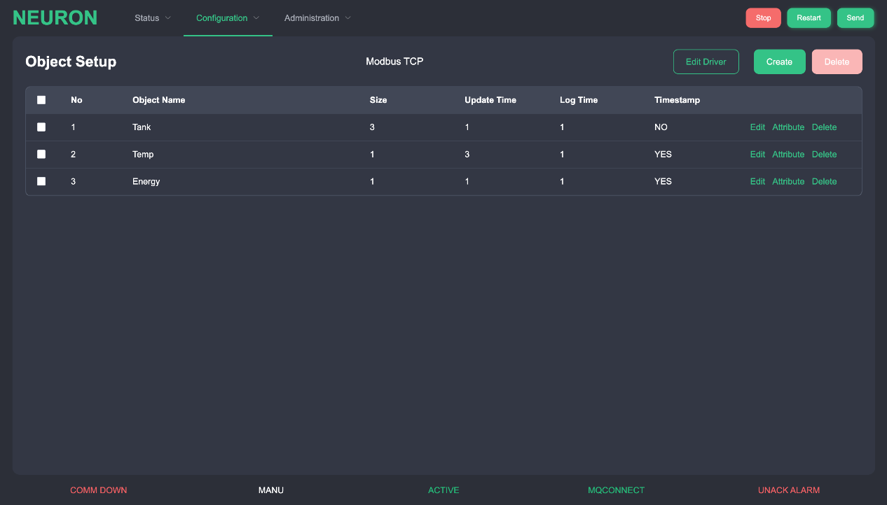
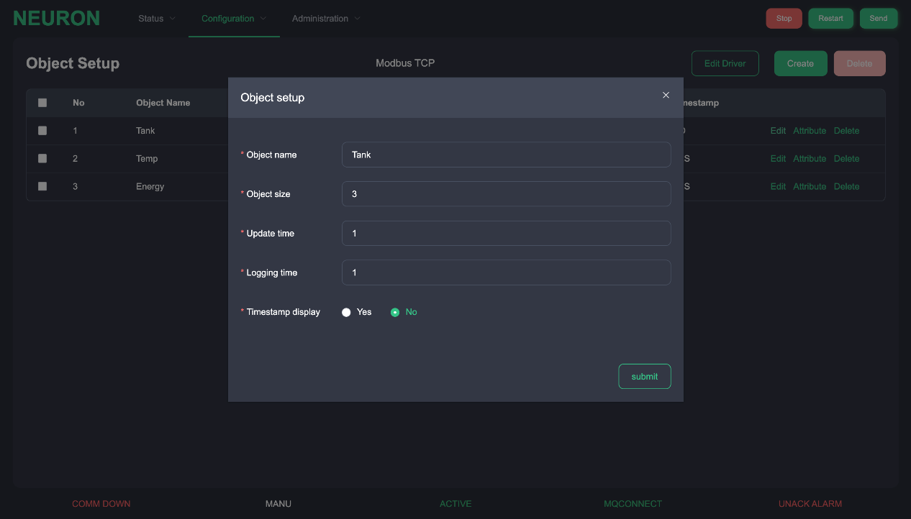
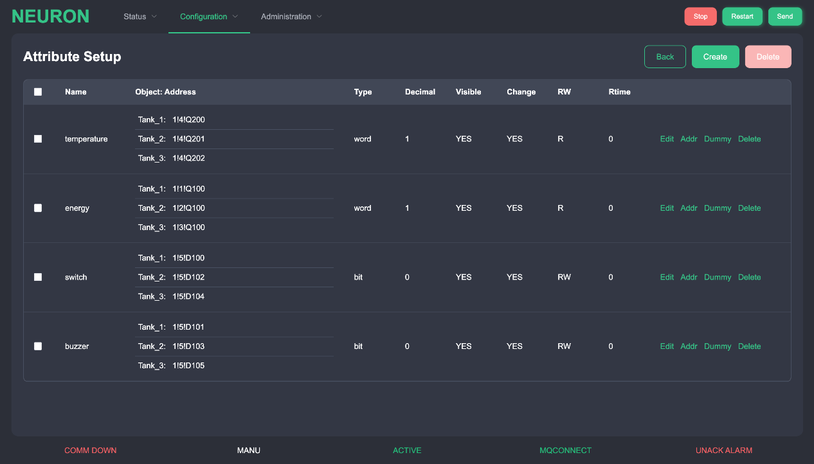
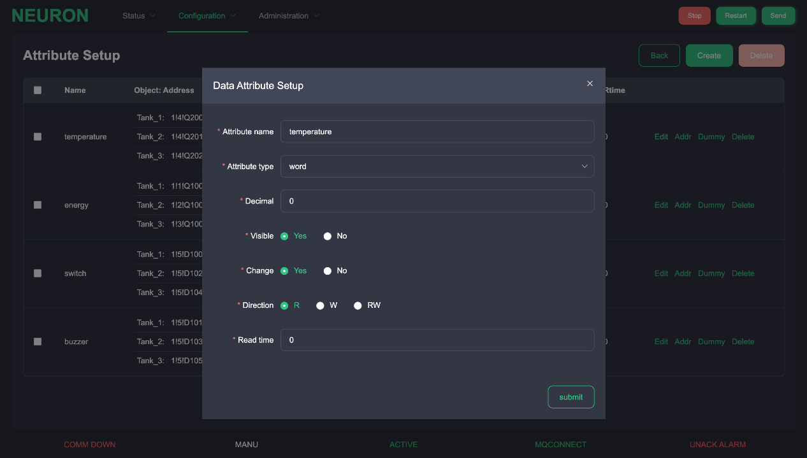

# Configuration Setup {#endpoint-configuration-setup}

These functions are used to setup the protocol communication details in terms of channel, object, attributes and tag address for data exchange with machine. Events and alarms are also defined in configuration for advance functions.

### Channel/Object/Attribute/Tag Setup {#endpoint-tag-setup}

By pressing &quot;New Driver&quot; button, there are two kinds of channel, hardware communication channel and cloud platform communication channel as shown.

Driver communication are used to setup the details for hardware device or PLC communication. Cloud communication are used to setup the communication with cloud platform. MQTT is the only selection at the moment. However, both channels have its own specific communication parameters in a list box.

For driver communication, there are two types communication driver.

| Type            | Description                                                         |
| --------------- | ------------------------------------------------------------------- |
| Ethernet driver | IP address/hostname and port number.                                |
| Serial driver   | Device file location, baud rate, data bit, stop bit and parity bit. |

For specific parameters of each driver, Here are some examples

| Variables/Paramters   | Description                                     |
| --------------------- | ----------------------------------------------- |
| USERNAME=neuron       | Username                                        |
| PASSWORD=\*\*\*\*\*\* | Password                                        |
| DLYCRESOCKAFTCLOSE=0  | Small delay time of socket creation after close |
| TORECEIVETCP=300      | TCP timeout to receive response                 |
| NAPTIMEREAD=40        | Small sleep time for read data polling          |
| NAPTIMEWRITE=40       | Small sleep time for write data polling         |
| SRC_ABKG=8            | AB driver parameters                            |
| S7P_SCRTSAP=0x10      | Siemens S7 driver parameters                    |
| S7P_DSTTSAP=0x0020    | Siemens S7 driver parameters                    |

After finishing the setup of Channel, start to setup object details.

To add an object to a list, press the &quot;Create&quot; button at the right. An object setup dialog box will be prompted.

| Column    | Description                                                                       |
| --------- | --------------------------------------------------------------------------------- |
| Name      | This is the name of the object. (30 characters)                                   |
| Size      | This is the number of objects that share the same attributes and characteristics. |
| Time      | This is time interval of data transmission rate. (in second)                      |
| Log Time  | This is time interval of data logging on the disk. (in second)                    |
| Timestamp | A flag that whether transfer timestamp with data. (Y/N)                           |

After finishing the object setup, press the attribute to enter to attribute setup.

By pressing the &quot;Create&quot; button, it will shows a input dialog box for attribute setup. Setup the name, attribute type and details. Changes can be made with Edit button. After making the changes, press &quot;Submit&quot; to save the changes.

After prompting up the address setup dialog, setup or change the addresses of the attribute. The number of addresses depends on the number of object.

| Column   | Description                                                                                                                                                                                                                                                                                                    |
| -------- | -------------------------------------------------------------------------------------------------------------------------------------------------------------------------------------------------------------------------------------------------------------------------------------------------------------- |
| Name     | This is the name of the attributes.                                                                                                                                                                                                                                                                            |
| Type     | This is data type of the attributes. It includes word – 2 bytes integer uword – 2 bytes unsigned integer dword – 4 bytes integer udword – 4 bytes unsigned integer bit – Boolean (Y/N) datetime – Unix timestamp value float – IEEE floating value double – IEEE double floating value |
| Decimal  | This is a decimal point for data type for word, uword, dword, udword only. Other data type will display &#39;-&#39;.                                                                                                                                                                                           |
| Transfer | This is a transmission flag that indicate entire object data would be transferred to platform. (Y/N)                                                                                                                                                                                                           |
| Change   | This is a changeable flag that indicate this attribute whether can be changed during operation. (Y/N)                                                                                                                                                                                                          |
| RW       | Read/Write direction for PLC, this represents the direction of read or write, or both read/write for PLC                                                                                                                                                                                                       |
| Rtime    | This is read polling time interval for PLC when RW is read or                                                                                                                                                                                                                                                  |

After clicking on the &quot;Address&quot; button, a dialog box will be prompted. Setup the hardware address in this dialog box. Please refer to Address Setup document for address string details for each driver. If no address specifies or dummy address, use &quot;-&quot; to represent in the field, it shows &#39;-&#39; in the field.

### Alarm/Event Message Setup {#endpoint-message-setup}

Some object attribute values can be setup to trigger an alarm or event by checking up its condition or comparing its own value with other preset values.

| Column     | Description                                                                                                                         |
| ---------- | ----------------------------------------------------------------------------------------------------------------------------------- |
| Object1    | This is first object of the message.                                                                                                |
| Attribute1 | This is first attribute of the message.                                                                                             |
| Type       | This is the operation type of message. It indicates whether bit operation, value operation, or text operation of an alarm.          |
| Object2    | This is second object of the message.                                                                                               |
| Attribute2 | This is second attribute of the message.                                                                                            |
| Cat        | This column is to distinguish the level of importance of each alarm such as, alarm, warning, event, log, command, etc.              |
| Sub        | If the field has Tag type, it would store the subroutine number of being called when there is a change to this tag in running mode. |

### Configuration Overview {#endpoint-configuration-overview}

The configuration overview page is only for overall configuration checking.

### Save New Configuration {#endpoint-new-configuration}

After finishing the configuration setup, press the &quot;Send&quot; button to transfer the configuration settings the Neuron system would check up. If it passes the checkup, it would restarts the system to initiate the new configuration. The web interface would be forcibly to logout once system restarts.
